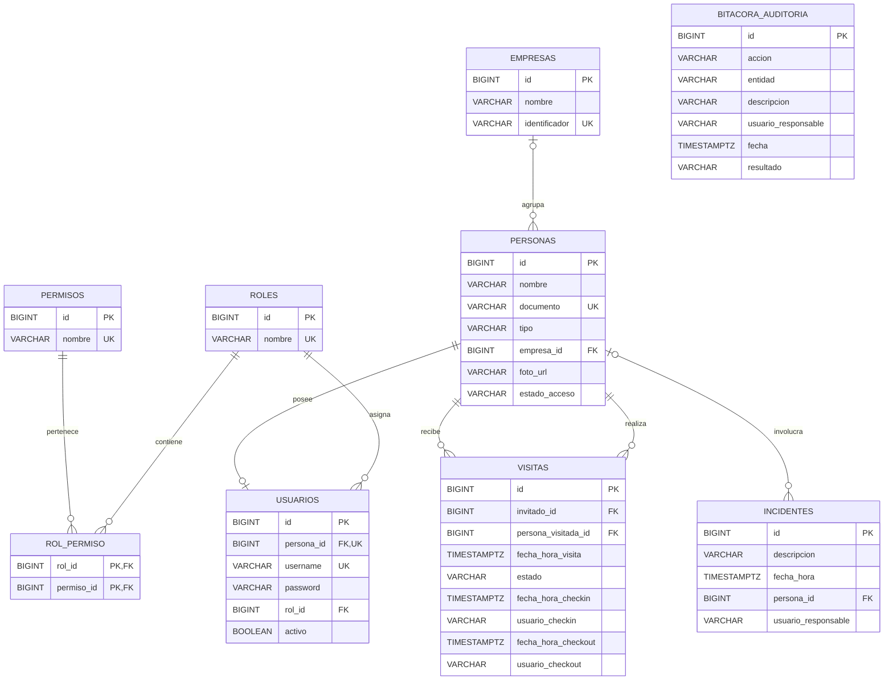

# SICA

Sistema Integrado de Control de Acceso para el complejo empresarial Zona Acme.

## Descripción

SICA es un proyecto Java que administra usuarios, personas, empresas, visitas,
solicitudes de aprobación, accesos, incidentes, auditoría y reportes. Su objetivo
es reemplazar el registro manual de entradas y salidas por información
centralizada, consultable y protegida mediante roles y permisos.

## Problema

Zona Acme reúne a más de 30 empresas, pero su control de acceso se realizaba con
libros de papel y comunicación por radio. Esto ocasionaba filas, información
ilegible, dificultad para conocer quién permanecía dentro y poca trazabilidad
ante incidentes. Tampoco existía una forma centralizada de restringir personas o
autorizar visitantes no anunciados.

## Solución

SICA centraliza los datos en PostgreSQL y aplica las siguientes reglas:

- Autorización RBAC mediante roles y permisos almacenados en la base de datos.
- Pre-registro y consulta de visitas.
- Check-in y check-out con identificación del guarda responsable.
- Aprobación o rechazo de visitantes no anunciados.
- Autorización excepcional para trabajadores que olvidan el carnet.
- Regularización automática de salidas olvidadas.
- Restricción o habilitación del acceso de personas.
- Registro de incidentes de seguridad.
- Bitácora inmutable para las operaciones críticas.
- Reportes de visitas y consulta de trazabilidad.

## Tecnologías

- Java 17.
- Maven.
- PostgreSQL.
- JDBC.
- PostgreSQL JDBC Driver 42.7.7.

## Arquitectura y organización

El proyecto aplica Arquitectura Hexagonal y Vertical Slices. Cada capacidad se
organiza en su propio paquete, por ejemplo `persona`, `visita`, `incidente` o
`auditoria`.

Dentro de cada capacidad se utilizan, cuando corresponden, estas capas:

```text
capacidad/
├── domain/          Entidades y estados del negocio
├── application/     Casos de uso, DTO, excepciones y puertos
└── infrastructure/  Adaptadores JDBC
```

Los servicios de aplicación dependen de interfaces y no conocen las consultas
SQL. Los detalles de PostgreSQL permanecen en los adaptadores de infraestructura.

## Flujo de trabajo Git Flow

El repositorio utiliza un flujo de ramas basado en Git Flow:

- `main`: contiene versiones estables listas para entrega.
- `develop`: integra el trabajo terminado de las diferentes funcionalidades.
- `feature/*`: se crea desde `develop` para desarrollar una historia de usuario.
- `release/*`: se crea desde `develop` para preparar una versión; al finalizar
  se integra en `main` y `develop`.
- `hotfix/*`: se crea desde `main` para corregir un problema urgente; al
  finalizar se integra en `main` y `develop`.

Flujo utilizado para una historia:

```text
develop
└── feature/e10-hu04-patrones
    └── merge hacia develop al terminar y verificar la historia
```

Las ramas `release/*` y `hotfix/*` solo deben crearse cuando exista una
liberación o una corrección urgente real. No se mantienen ramas vacías para
simular su utilización.

## Modelo entidad-relación

El siguiente diagrama representa el modelo PostgreSQL oficial definido en
`schema.sql`.

Para crear la base y toda su estructura desde cero con PostgreSQL se utiliza:

```bash
psql -U postgres -f ddl_postgresql.sql
```

`ddl_postgresql.sql` crea `sica_db`, se conecta y carga `schema.sql`. El esquema
es un script de reconstrucción: utiliza
`DROP TABLE IF EXISTS` antes de crear las tablas, por lo que elimina los datos
anteriores. No debe ejecutarse sobre una base que se quiera conservar.

Después de crear la estructura, los datos iniciales oficiales se cargan con:

```bash
psql -U postgres -d sica_db -f data.sql
```

`data.sql` se ejecuta dentro de una transacción e incluye roles, permisos,
RBAC, usuarios de prueba, empresas, personas, auditoría y visitas para los
flujos principales. El archivo complementario `dml_postgresql.sql` conserva
ejemplos controlados de `INSERT`, `UPDATE`, `DELETE` y consultas `SELECT`.

### Privilegios PostgreSQL (DCL)

Después del DDL se configura la cuenta técnica de la aplicación con:

```bash
psql -U postgres -d sica_db -f dcl_postgresql.sql
```

El script solicita de forma segura una contraseña para `sica_app`; no se guarda
ninguna contraseña PostgreSQL en el repositorio. Esta cuenta no es superusuario
y no puede crear bases de datos, roles ni tablas. Puede consultar las tablas,
modificar los datos operativos e insertar registros de auditoría, pero no puede
actualizar ni eliminar la bitácora.

Los niveles de autorización no se mezclan:

- **RBAC de SICA:** las tablas `roles`, `permisos` y `rol_permiso` determinan
  qué acciones funcionales puede realizar una persona dentro de la aplicación.
- **DCL de PostgreSQL:** `sica_aplicacion` y `sica_app` determinan qué comandos
  puede ejecutar técnicamente la conexión Java sobre la base de datos.

La aplicación deberá conectarse con `sica_app`. La cuenta administrativa
`postgres` se reserva para ejecutar scripts de instalación y mantenimiento.

### Organización de scripts SQL

Los entregables obligatorios `schema.sql` y `data.sql` permanecen en la raíz de
`sica`. La carpeta `database/` organiza puntos de entrada por responsabilidad;
estos reutilizan las fuentes oficiales con `\ir`, por lo que no se mantienen
copias independientes que puedan quedar desactualizadas.

```text
database/
├── schema.sql
├── data.sql
├── ddl/
│   └── 01_create_database.sql
├── dml/
│   ├── 01_seed_data.sql
│   └── 02_operations_examples.sql
├── dcl/
│   └── 01_roles_permissions.sql
├── tcl/
│   └── 01_transactions.sql
├── tests/
│   └── 01_integrity_transactions.sql
└── diagrams/
    └── modelo-er.md
```

Las restricciones y transacciones se validan después de cargar los datos con:

```bash
psql -U postgres -d sica_db -f database/tests/01_integrity_transactions.sql
```

La prueba comprueba FK inexistente, PK duplicada, campos `NULL`, valores fuera
de los estados permitidos, documentos duplicados, `ROLLBACK`, `COMMIT` y
`SAVEPOINT`. Los datos temporales utilizados por la prueba se eliminan al
finalizar.

La integración de Java con la base real se comprueba desde una terminal que
tenga definidas `SICA_DB_URL`, `SICA_DB_USER` y `SICA_DB_PASSWORD`:

```bash
mvn -Dtest=PostgresqlIntegracionTest test
```

Esta prueba verifica la conexión con `sica_app`, login exitoso y fallido, RBAC,
consulta de una visita y escritura/lectura de auditoría. Si no se define
`SICA_DB_PASSWORD`, JUnit la omite para que las pruebas unitarias puedan
ejecutarse sin depender de una instalación local.

### Transacciones PostgreSQL (TCL)

El flujo transaccional de salida olvidada se prueba con:

```bash
psql -U postgres -d sica_db -f tcl_postgresql.sql
```

El script utiliza `BEGIN`, `SAVEPOINT`, `COMMIT`, `ROLLBACK TO SAVEPOINT` y
`ROLLBACK`. La regularización bloquea la visita abierta con `FOR UPDATE`, cierra
la visita anterior, crea el nuevo ingreso y registra la auditoría como una sola
unidad. Si el proceso falla antes del `COMMIT`, la transacción puede revertirse
sin dejar una visita cerrada sin su nuevo registro.

El mismo archivo incluye una segunda transacción de prueba que cambia
temporalmente un estado de acceso y luego ejecuta `ROLLBACK`; por lo tanto, ese
cambio no permanece en la base.



Una persona puede pertenecer a una empresa. Cada visita referencia a la persona
que ingresa y a la persona visitada. Un incidente puede asociarse opcionalmente
a una persona. La bitácora conserva el responsable como texto para mantener su
identidad histórica aunque un usuario sea eliminado.

### Normalización hasta Cuarta Forma Normal

El modelo PostgreSQL cumple las formas normales de la siguiente manera:

- **1FN:** cada columna contiene un valor atómico. No se guardan listas de
  permisos, empresas o visitas dentro de una columna.
- **2FN:** las tablas con una clave de una sola columna dependen completamente
  de esa clave. En `rol_permiso`, que tiene clave compuesta, no existen datos
  adicionales que dependan solo de `rol_id` o solo de `permiso_id`.
- **3FN:** los datos descriptivos dependen de la entidad a la que pertenecen.
  `usuarios` ya no repite nombre y documento: utiliza `persona_id`, mientras
  `personas` conserva esos datos una única vez. Así se evita que el documento o
  nombre de una cuenta sea diferente al de su persona.
- **4FN:** la relación multivaluada independiente rol-permiso se representa con
  `rol_permiso`. Cada fila asocia un solo rol con un solo permiso, permitiendo
  agregar o retirar permisos sin modificar la tabla `roles`.

Dependencias resueltas:

- La dependencia parcial de una posible relación rol-permiso se eliminó con la
  clave compuesta `(rol_id, permiso_id)` y sin atributos dependientes de una
  sola parte.
- La duplicación transitiva `usuario -> documento -> datos personales` se
  eliminó mediante la relación única `usuarios.persona_id -> personas.id`.
- La dependencia multivaluada `rol ->> permiso` quedó separada en
  `rol_permiso`.

Los nombres de usuario guardados en visitas, incidentes y bitácora son una
instantánea histórica deliberada: permiten conservar quién ejecutó una acción
aunque la cuenta cambie posteriormente. No representan listas ni dependencias
multivaluadas. Las restricciones `UNIQUE`, `CHECK`, claves foráneas y reglas
`ON DELETE` evitan duplicados y referencias inconsistentes.

## Decisiones de diseño

### Persistencia intercambiable: Local Storage y PostgreSQL

La lógica de negocio no conoce el mecanismo de almacenamiento. Los servicios
dependen de puertos como `UsuarioRepositoryPort`, `PersonaRepositoryPort` y
`VisitaRepositoryPort`; los adaptadores son los encargados de implementar esos
contratos.

```text
                         ┌── Adaptador Local Storage (interfaz web)
Aplicación → Servicio → Puerto de repositorio
                         └── Adaptador JDBC PostgreSQL
```

Por ejemplo, `VisitaService` recibe un `VisitaRepositoryPort` mediante su
constructor. Las pruebas de los flujos usan una implementación local en memoria
y ejecutan la misma lógica de pre-registro, aprobación, check-in, check-out y
regularización que utilizará el adaptador PostgreSQL. El servicio no cambia al
reemplazar un adaptador por otro.

`localStorage` es una API propia del navegador. Como SICA todavía es una
aplicación Java sin interfaz web, no se accede a ella desde los servicios Java.
Cuando se agregue el frontend, su adaptador Local Storage deberá implementar el
mismo contrato de persistencia en esa capa. Durante las pruebas Java, los
repositorios en memoria representan ese almacenamiento temporal.

La selección ocurre en el punto de arranque de la aplicación:

```text
Modo local:       Servicio → RepositoryPort → almacenamiento local temporal
Modo PostgreSQL:  Servicio → RepositoryPort → adaptador JDBC PostgreSQL
```

Los adaptadores JDBC PostgreSQL permanecen en `infrastructure`; esta tecnología
afecta esa capa y la configuración de conexión, no los servicios ni las
entidades del dominio. Esta separación aplica Arquitectura
Hexagonal y el principio DIP de SOLID.

### RBAC almacenado en la base de datos

Los permisos no se determinan mediante condiciones fijas por nombre de rol.
`AutorizacionService` busca el usuario y consulta en `rol_permiso` si su rol
posee el permiso requerido. Esto permite cambiar autorizaciones desde los datos.

### Auditoría desde la capa de aplicación

Los servicios registran en `BitacoraAuditoriaPort` después de completar una
operación crítica. El adaptador agrega fecha, entidad y resultado. Dos triggers
de PostgreSQL impiden modificar o eliminar los registros históricos.

### Estados mediante enumeraciones

`EstadoVisita` y `EstadoAcceso` representan valores permitidos en el código y
evitan utilizar textos diferentes para una misma regla de negocio.

### JDBC aislado en infraestructura

Las conexiones, sentencias SQL y `ResultSet` se utilizan solamente en
`infrastructure`. El dominio y los servicios no dependen de JDBC.

## Principios SOLID

- **SRP:** cada servicio administra una capacidad y cada adaptador se ocupa de
  persistencia.
- **OCP:** puede agregarse otro adaptador implementando un puerto sin modificar
  los servicios.
- **LSP:** cualquier implementación que respete un puerto puede sustituir al
  adaptador JDBC correspondiente.
- **ISP:** existen puertos específicos por capacidad. Auditoría separa escritura
  (`BitacoraAuditoriaPort`) y consulta (`BitacoraConsultaPort`).
- **DIP:** los servicios reciben los puertos mediante sus constructores y no
  crean adaptadores concretos.

## Patrones de diseño

### Repository

Interfaces como `UsuarioRepositoryPort`, `PersonaRepositoryPort`,
`VisitaRepositoryPort` e `IncidenteRepositoryPort` representan las operaciones
de persistencia que necesita la aplicación. Los servicios no contienen SQL y
pueden trabajar con cualquier implementación de estos contratos.

### Adapter

Clases como `UsuarioRepositoryJdbcAdapter`, `PersonaRepositoryJdbcAdapter` y
`VisitaRepositoryJdbcAdapter` traducen las operaciones de los puertos a JDBC.
Este patrón mantiene PostgreSQL fuera de dominio y aplicación.

## Instalación

### Ejecución recomendada con Docker

Este es el procedimiento validado para ejecutar SICA en otro computador con
Windows, macOS o Linux. Docker contiene PostgreSQL, Java 17, Maven, JavaFX y la
aplicación completa. El equipo anfitrión solo necesita:

- Docker con Docker Compose versión 2.
- Git para clonar el repositorio.
- Un navegador.

En Windows y macOS se recomienda Docker Desktop. En Linux puede utilizarse
Docker Engine con el complemento Docker Compose.

#### 1. Clonar y ubicar el proyecto

Clona el repositorio y entra en su carpeta raíz:

~~~bash
git clone URL_DEL_REPOSITORIO
cd SICA
~~~

En esa ubicación deben existir:

~~~text
compose.yaml
docker/
pom.xml
sica/
~~~

En Linux y macOS se comprueba con `ls`. En PowerShell se puede utilizar
`Get-ChildItem`. Todos los comandos siguientes deben ejecutarse en la carpeta
que contiene `compose.yaml`.

#### 2. Verificar Docker

~~~bash
docker --version
docker compose version
docker info
~~~

Si `docker info` falla:

- En Windows o macOS, abre Docker Desktop y espera a que termine de iniciar.
- En Linux, ejecuta `sudo systemctl start docker`.
- Si Linux indica falta de permisos, ejecuta
  `sudo usermod -aG docker "$USER"`, cierra completamente la sesión y vuelve a
  entrar.

#### 3. Primera ejecución

~~~bash
docker compose up -d --build
~~~

La primera ejecución puede tardar varios minutos. Docker:

1. Crea `sica-postgres` con PostgreSQL 17 y la base `sica_db`.
2. Ejecuta `schema.sql` y crea las tablas, relaciones, restricciones y triggers.
3. Ejecuta `data.sql` y carga los datos iniciales.
4. Configura el usuario técnico limitado `sica_app`.
5. Construye e inicia `sica-app`.
6. Ejecuta JavaFX en un escritorio virtual accesible con noVNC.

No es necesario instalar Java, Maven ni PostgreSQL en el equipo anfitrión.

#### 4. Comprobar el estado

~~~bash
docker compose ps -a
~~~

El resultado esperado es:

~~~text
sica-postgres   Up (healthy)
sica-app        Up
~~~

Para observar el inicio:

~~~bash
docker compose logs -f app
~~~

Cuando aparezca:

~~~text
SICA esta disponible en http://localhost:6080/vnc.html?autoconnect=true&resize=scale
~~~

presiona `Ctrl + C`. Esto cierra la consulta de registros, no los contenedores.

#### 5. Abrir SICA

Abre en el navegador:

~~~text
http://localhost:6080/vnc.html?autoconnect=true&resize=scale
~~~

noVNC debe conectarse automáticamente. Si muestra `Conectar`, presiónalo.

| Rol | Usuario | Contraseña |
|---|---|---|
| Administrador | `admin` | `admin123` |
| Guarda de Seguridad | `guarda` | `guarda123` |
| Funcionario | `funcionario` | `funcionario123` |

#### Volver a abrir el programa

Si solamente cerraste el navegador, abre nuevamente la dirección de noVNC.

Si reiniciaste el computador o detuviste los contenedores:

~~~bash
cd ruta/donde/clonaste/SICA
docker compose up -d
docker compose ps -a
~~~

Si cerraste la ventana JavaFX dentro de noVNC:

~~~bash
docker compose up -d app
~~~

Si `sica-app` no vuelve a iniciar:

~~~bash
docker compose up -d --force-recreate app
~~~

Esto recrea solamente la aplicación y conserva PostgreSQL.

#### Actualizar una copia clonada

~~~bash
git pull
docker compose up -d --build
~~~

#### Comandos en caso de fallo

Consulta los servicios, incluidos los detenidos:

~~~bash
docker compose ps -a
~~~

Revisa los últimos mensajes:

~~~bash
docker compose logs --tail=150 postgres
docker compose logs --tail=150 app
~~~

En Linux o macOS se pueden filtrar errores:

~~~bash
docker compose logs app | grep -i -E "error|exception|failed|caused"
~~~

Si noVNC muestra `Failed to connect to server` y `sica-app` aparece como
`Exited`:

~~~bash
docker compose up -d app
docker compose up -d --force-recreate app
~~~

Si PostgreSQL no aparece como `healthy`:

~~~bash
docker compose logs --tail=150 postgres
docker compose restart postgres
docker compose ps -a
~~~

Para reconstruir únicamente la aplicación:

~~~bash
docker compose build app
docker compose up -d --force-recreate app
~~~

#### Detener SICA conservando los datos

~~~bash
docker compose down
~~~

La información permanece en el volumen `sica_postgres_data`.

#### Reconstruir la base desde cero

El siguiente procedimiento elimina permanentemente todos los datos guardados:

~~~bash
docker compose down -v
docker compose up -d --build
~~~

Debe utilizarse solamente cuando se quiera borrar y reconstruir completamente
la base. No debe usarse como solución normal para reiniciar SICA.

#### Desarrollo desde VS Code

En la modalidad anterior Docker ejecuta `Main`, por lo que no es necesario usar
`Ejecutar y depurar`. Para ejecutar `Main` directamente desde VS Code se
necesitan JDK, Maven y la extensión Java; la tarea de Windows inicia solamente
PostgreSQL antes de abrir JavaFX.

### Instalación manual sin Docker (alternativa)

Esta sección solo aplica si no se utilizará el inicio recomendado con Docker.
Para la instalación manual se necesita:

- JDK 17 o superior.
- Maven 3.9 o superior.
- PostgreSQL en ejecución.
- Un usuario administrador de PostgreSQL para ejecutar la instalación.

### Configurar la conexión

La conexión se encuentra en:

```text
src/main/java/com/sica/infraestructura/ConexionBD.java
```

Se deben ajustar estos valores según el entorno local:

```text
SICA_DB_URL=jdbc:postgresql://localhost:5432/sica_db
SICA_DB_USER=sica_app
SICA_DB_PASSWORD=tu_contrasena
```

### Crear la estructura PostgreSQL

Desde una terminal ubicada en la carpeta del proyecto se ejecuta:

```bash
psql -U postgres -f ddl_postgresql.sql
```

El cargador crea `sica_db` y ejecuta el archivo obligatorio `schema.sql` para
crear tablas, relaciones, restricciones, índices y triggers. Como `schema.sql`
reconstruye la estructura, no debe ejecutarse sobre datos que se quieran
conservar.

La aplicación lee estos valores desde variables de entorno y utiliza por
defecto la URL local y el usuario técnico `sica_app`.

Si `SICA_DB_PASSWORD` no está definida, la interfaz abre automáticamente la
pantalla **Conexión con PostgreSQL**. La configuración validada se guarda en
el perfil local del usuario, en `~/.sica/conexion.properties`, fuera del
repositorio. El archivo local tiene prioridad para que la configuración elegida
desde la interfaz o generada por Docker no dependa del entorno de VS Code. Si
no existe ese archivo, se utilizan las variables de entorno.

### Compilar

Desde la carpeta que contiene `pom.xml`:

```bash
mvn clean compile
```

### Ejecutar la interfaz JavaFX

Con PostgreSQL activo y las variables `SICA_DB_URL`, `SICA_DB_USER` y
`SICA_DB_PASSWORD` definidas en la terminal:

```bash
mvn javafx:run
```

SICA abre una ventana de inicio de sesión construida con JavaFX, FXML y CSS.
Las credenciales se validan mediante `LoginService` y PostgreSQL; no se utiliza
la terminal ni `JOptionPane` como interfaz. Después de autenticarse se muestra
un panel principal con un menú dinámico: cada rol solamente ve los módulos
permitidos por el RBAC almacenado en PostgreSQL.

Las pantallas disponibles cubren usuarios, roles y permisos, personas,
empresas, visitas, control de acceso, solicitudes de aprobación, incidentes,
auditoría y reportes. En **Control de acceso**, el guarda consulta el documento,
ve la persona, anfitrión, estado y URL de fotografía, y solamente entonces
registra el check-in o check-out. En **Solicitudes**, el estado se refresca
automáticamente cada cuatro segundos para reflejar la respuesta del funcionario.

La capa visual vive en `com.sica.presentacion`. Sus controladores llaman a los
servicios y puertos existentes, pero no contienen SQL ni reglas de negocio.

Para generar el paquete:

```bash
mvn clean package
```

## Ejecución

La clase principal actual es:

```text
src/main/java/com/sica/Main.java
```

Puede ejecutarse desde la configuración **Ejecutar SICA** de VS Code o desde
la carpeta `sica` con el plugin de JavaFX:

```bash
mvn javafx:run
```

`Main` inicia la aplicación JavaFX. La interfaz expone los casos de uso mediante
controladores de presentación y conserva la lógica de negocio dentro de los
servicios de aplicación.

## Guía de uso

Los principales casos de uso disponibles son:

| Operación | Servicio o método principal | Rol de ejemplo |
|---|---|---|
| Iniciar sesión | `LoginService.iniciarSesion` | Todos |
| Crear usuario | `UsuarioService.crearUsuario` | Administrador |
| Gestionar roles | `RolService.asociarPermisoARol` | Administrador |
| Registrar persona | `PersonaService.registrarPersona` | Funcionario |
| Gestionar empresa | `EmpresaService` | Funcionario |
| Pre-registrar visita | `VisitaService.preRegistrarInvitado` | Funcionario |
| Consultar visita | `VisitaService.consultarVisitaPorDocumento` | Guarda |
| Registrar check-in | `VisitaService.registrarCheckIn` | Guarda |
| Registrar check-out | `VisitaService.registrarCheckOut` | Guarda |
| Solicitar visita no anunciada | `VisitaService.registrarVisitanteNoAnunciado` | Guarda |
| Solicitar ingreso por olvido | `VisitaService.solicitarIngresoPorOlvido` | Guarda |
| Aprobar o rechazar solicitud | `VisitaService.aprobarSolicitud` / `rechazarSolicitud` | Funcionario |
| Cambiar estado de acceso | `PersonaService.cambiarEstadoAcceso` | Administrador |
| Registrar incidente | `IncidenteService.registrarIncidente` | Guarda |
| Generar reporte | `ReporteService.generarReporteVisitasPorEstado` | Administrador |
| Consultar bitácora | `AuditoriaService.consultarBitacora` | Administrador |

Para las aprobaciones, el documento del usuario funcionario debe coincidir con
el documento de su registro en `personas`. Los datos iniciales ya cumplen esta
condición.

## Credenciales de ejemplo

Las siguientes credenciales son creadas por `data.sql`:

| Rol | Usuario | Contraseña |
|---|---|---|
| Administrador | `admin` | `admin123` |
| Guarda de Seguridad | `guarda` | `guarda123` |
| Funcionario | `funcionario` | `funcionario123` |

Estas contraseñas son exclusivamente de demostración. El servicio actual las
compara directamente; no deben utilizarse en un entorno de producción.
