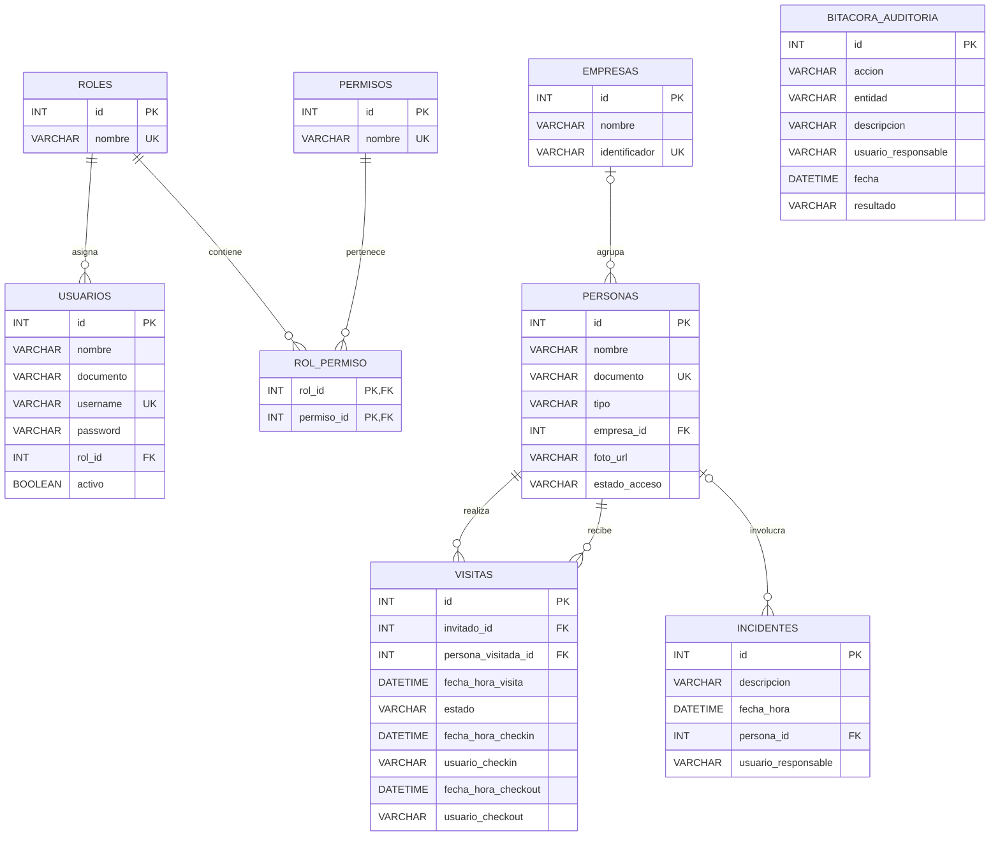

# SICA

Sistema Integrado de Control de Acceso para el complejo empresarial Zona Acme.

## Patrones de diseño

### Repository

El patrón Repository separa la lógica de negocio de la forma en que se
almacenan y consultan los datos. En SICA, los repositorios se definen mediante
interfaces como:

- `UsuarioRepositoryPort`
- `PersonaRepositoryPort`
- `EmpresaRepositoryPort`
- `VisitaRepositoryPort`
- `IncidenteRepositoryPort`

Los servicios de aplicación dependen de estas interfaces y no contienen
consultas SQL. Esto permite cambiar la forma de persistencia sin modificar las
reglas de negocio.

### Adapter

El patrón Adapter permite conectar los puertos definidos por la aplicación con
la tecnología utilizada para guardar los datos. Las clases JDBC adaptan las
operaciones de los repositorios a consultas de MySQL. Algunos ejemplos son:

- `UsuarioRepositoryJdbcAdapter`
- `PersonaRepositoryJdbcAdapter`
- `VisitaRepositoryJdbcAdapter`
- `IncidenteRepositoryJdbcAdapter`
- `BitacoraAuditoriaJdbcAdapter`

Este patrón es necesario porque JDBC utiliza conexiones, sentencias SQL y
resultados que no deben llegar a las capas de dominio o aplicación. Los
adaptadores concentran esos detalles dentro de `infrastructure`.

## Relación con la arquitectura

Repository define qué operaciones de persistencia necesita cada capacidad del
sistema. Adapter implementa esas operaciones usando JDBC. De esta forma, las
dependencias apuntan hacia los puertos de aplicación y se conserva la
separación establecida por la arquitectura hexagonal.

## Modelo entidad-relación

El siguiente diagrama representa las tablas y relaciones definidas en
`schema.sql`:

Una persona puede pertenecer a una empresa, pero esta asociación es opcional.
Cada visita referencia obligatoriamente a la persona que ingresa y a la persona
visitada. Un incidente puede asociarse a una persona cuando corresponda.

La bitácora conserva `usuario_responsable` como texto en lugar de una clave
foránea. Esto permite mantener la identidad histórica incluso si posteriormente
se elimina el usuario del sistema.
