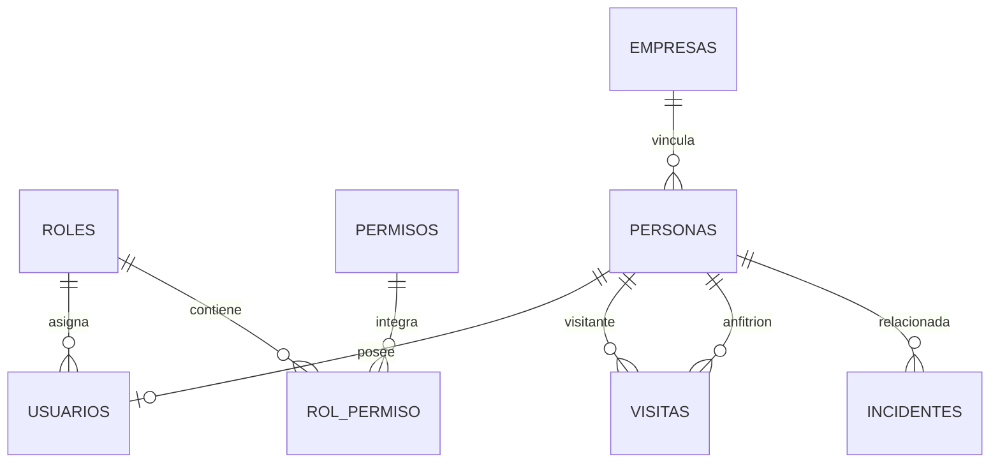

# SICA

Sistema Integrado de Control de Acceso para el complejo empresarial Zona Acme.

## Autor

Juan José Ricardo Rangel Sandoval

## Descripción

SICA es una aplicación de escritorio desarrollada en Java para sustituir el
registro manual de entradas y salidas de Zona Acme. Centraliza usuarios,
empresas, personas, visitas, solicitudes, incidentes y auditoría en PostgreSQL,
y proporciona una interfaz JavaFX adaptada a los permisos del usuario.

El proyecto tiene un alcance académico y favorece soluciones claras y
mantenibles, Arquitectura Hexagonal, Vertical Slices, RBAC, principios SOLID y
separación entre la lógica de negocio y la infraestructura.

## Problema

El control basado en libros de papel y comunicación por radio provoca filas,
registros ilegibles y poca trazabilidad. También dificulta conocer quién está
dentro, autorizar una visita en tiempo real, restringir el acceso e investigar
posteriormente un incidente.

## Objetivo general

Automatizar y asegurar el control de acceso de Zona Acme mediante una aplicación
capaz de identificar personas, autorizar visitas, registrar entradas y salidas,
regularizar inconsistencias y conservar evidencia auditable.

## Objetivos específicos

- Autenticar usuarios y limitar sus acciones mediante roles y permisos.
- Gestionar usuarios, personas, empresas, visitas e incidentes.
- Permitir pre-registros y solicitudes de aprobación en tiempo real.
- Registrar check-in y check-out solamente si el acceso está autorizado.
- Detectar y regularizar salidas olvidadas sin bloquear el nuevo ingreso.
- Consultar las personas que permanecen dentro del complejo.
- Mantener una bitácora de auditoría inmutable.
- Generar reportes para usuarios autorizados.
- Mantener el negocio independiente de PostgreSQL y JavaFX.
- Proporcionar una instalación reproducible mediante Docker.

## Funcionalidades

### Seguridad y RBAC

- Inicio de sesión con registro de intentos exitosos y fallidos.
- Roles `ADMINISTRADOR`, `GUARDA_SEGURIDAD` y `FUNCIONARIO`.
- Permisos configurables desde PostgreSQL.
- Menú JavaFX dinámico según los permisos del usuario autenticado.
- Mensajes claros cuando una operación no está autorizada.

### Personas, empresas y usuarios

- Creación, consulta, actualización y eliminación de usuarios.
- Consulta y asociación de roles y permisos.
- Gestión de personas, empresas y URL de fotografía.
- Identificación mediante documento.
- Estado de acceso habilitado o restringido.

### Visitas y control de acceso

- Pre-registro de invitados con estado `APROBADO`.
- Consulta de visitante, anfitrión, fotografía y autorización.
- Check-in, check-out y consulta de personas dentro.
- Bloqueo del ingreso cuando la visita está pendiente o rechazada.
- Registro del usuario responsable de la entrada y la salida.

### Solicitudes de aprobación

- Registro de invitados no anunciados.
- Solicitud excepcional para trabajadores sin carnet.
- Aprobación o rechazo por el funcionario correspondiente.
- Actualización automática de la pantalla cada cuatro segundos.

### Salidas olvidadas

Cuando una persona con una visita en estado `DENTRO` vuelve a ingresar, SICA:

1. Detecta la visita abierta.
2. La cierra como `CERRADA_POR_SISTEMA`.
3. Registra la salida con usuario `SISTEMA`.
4. Crea una nueva visita.
5. Permite continuar con el ingreso.
6. Registra la regularización en auditoría.

### Incidentes, auditoría y reportes

- Registro de incidentes con fecha, descripción y persona opcional.
- Auditoría de login, usuarios, personas, empresas, incidentes y accesos.
- Bitácora protegida contra actualizaciones y eliminaciones normales.
- Consulta de usuario, acción, entidad, fecha y resultado.
- Reportes de visitas para usuarios con `generar_reporte`.

## Tecnologías utilizadas

| Tecnología | Uso |
|---|---|
| Java 17 | Lenguaje y lógica del sistema |
| JavaFX 17 | Interfaz gráfica de escritorio |
| FXML y CSS | Vistas y tema visual |
| Maven 3.9 | Dependencias, compilación, pruebas y ejecución |
| PostgreSQL 17 | Persistencia relacional |
| JDBC 42.7.7 | Comunicación entre Java y PostgreSQL |
| JUnit 5 | Pruebas unitarias y de integración |
| Docker Compose | PostgreSQL reproducible en diferentes equipos |
| Git y Git Flow | Control de versiones y organización de ramas |

## Arquitectura

SICA utiliza Arquitectura Hexagonal organizada mediante Vertical Slices. Cada
capacidad contiene sus propias clases de dominio, aplicación e infraestructura.

```text
com.sica/
├── autenticacion/    Inicio de sesión
├── autorizacion/     Verificación de permisos
├── usuario/          Usuarios del sistema
├── rol/              Roles y permisos
├── persona/          Trabajadores e invitados
├── empresa/          Empresas de Zona Acme
├── visita/           Visitas, accesos y solicitudes
├── incidente/        Incidentes de seguridad
├── auditoria/        Bitácora y trazabilidad
├── reporte/          Reportes
├── infraestructura/  Conexión compartida
└── presentacion/     JavaFX, FXML y navegación
```

Estructura habitual de una capacidad:

```text
modulo/
├── domain/          Entidades y estados del negocio
├── application/     Servicios, DTO, puertos y excepciones
└── infrastructure/  Adaptadores JDBC
```

El sentido de las dependencias es:

```text
JavaFX -> Servicios de aplicación -> Puertos <- Adaptadores PostgreSQL
```

Los servicios no contienen SQL y los adaptadores no deciden reglas de negocio.

## Principios y patrones

- SRP: servicios, controladores, entidades y repositorios tienen tareas separadas.
- OCP: nuevos adaptadores pueden implementar los puertos existentes.
- LSP: adaptadores JDBC y repositorios de prueba respetan los mismos contratos.
- ISP: los puertos se dividen por capacidad.
- DIP: los servicios dependen de interfaces y no de JDBC.
- Repository: los puertos representan repositorios de cada agregado.
- Adapter: JDBC implementa los puertos sin modificar el negocio.
- MVC: FXML representa la vista y los controladores coordinan servicios.
- Streams y lambda: se utilizan para filtrar y transformar colecciones.

## Base de datos

El modelo PostgreSQL está normalizado hasta Cuarta Forma Normal cuando existen
relaciones multivaluadas independientes. Roles y permisos se relacionan mediante
`rol_permiso`, sin guardar listas dentro de columnas.

### Modelo entidad-relación



La definición exacta y vigente se encuentra en `schema.sql`.

### Scripts disponibles

```text
sica/
├── schema.sql                 Estructura completa obligatoria
├── data.sql                   Datos iniciales obligatorios
├── ddl_postgresql.sql         Creación y carga del esquema
├── dml_postgresql.sql         Operaciones DML
├── dcl_postgresql.sql         Roles y privilegios PostgreSQL
├── tcl_postgresql.sql         Transacciones
└── database/
    ├── schema.sql
    ├── data.sql
    ├── ddl/
    ├── dml/
    ├── dcl/
    ├── tcl/
    ├── tests/
    └── diagrams/
```

Los archivos dentro de `database/` cumplen la separación por responsabilidad.
`schema.sql` y `data.sql` permanecen también en la raíz de `sica` porque son
entregables obligatorios.

## Requisitos

### Ejecución recomendada

- Windows 10 u 11.
- Docker Desktop instalado y abierto.
- Java JDK 17 o superior.
- Maven 3.9 o superior.

### Ejecución manual

- Java JDK 17 o superior.
- Maven 3.9 o superior.
- PostgreSQL 17 o compatible.
- Cliente `psql` disponible en `PATH`.

Comprobar herramientas:

```powershell
java -version
mvn -version
docker --version
docker compose version
```

## Ejecutar en Windows con Docker

1. Descargar o clonar el proyecto.
2. Abrir Docker Desktop.
3. Abrir PowerShell en la raíz del repositorio.
4. Ejecutar:

```powershell
.\iniciar-sica.ps1
```

También puede utilizarse:

```cmd
iniciar-sica.cmd
```

El script:

- Genera contraseñas locales en `.env` si no existen.
- Crea `%USERPROFILE%\.sica\conexion.properties`.
- Inicia PostgreSQL en Docker.
- Ejecuta `schema.sql`, `data.sql` y la configuración DCL.
- Espera hasta que PostgreSQL esté disponible.

Después puede ejecutarse `Ejecutar SICA` desde VS Code o:

```powershell
cd sica
mvn javafx:run
```

## Ejecutar con Docker en Linux o macOS

1. Copiar `.env.example` como `.env` y cambiar las dos contraseñas.
2. Iniciar PostgreSQL:

```bash
docker compose up -d --wait
```

3. Usar la misma `SICA_APP_PASSWORD` definida en `.env`:

```bash
export SICA_DB_URL='jdbc:postgresql://localhost:5433/sica_db'
export SICA_DB_USER='sica_app'
export SICA_DB_PASSWORD='contraseña_definida_en_env'
cd sica
mvn clean verify
mvn javafx:run
```

## Instalación manual de PostgreSQL

Desde la carpeta `sica`, ejecutar con un administrador de PostgreSQL:

```bash
psql -U postgres -f ddl_postgresql.sql
psql -U postgres -d sica_db -f data.sql
psql -U postgres -d sica_db -f dcl_postgresql.sql
```

Después definir:

```text
SICA_DB_URL=jdbc:postgresql://localhost:5432/sica_db
SICA_DB_USER=sica_app
SICA_DB_PASSWORD=contraseña_del_usuario_sica_app
```

Si no existe una contraseña configurada, SICA abre una pantalla para probar y
guardar la conexión local. Las credenciales técnicas no se incluyen en Git.

## Compilación y pruebas

Desde la raíz del repositorio o desde `sica`:

```bash
mvn clean verify
```

Para ejecutar solamente las pruebas:

```bash
mvn test
```

El paquete se genera en:

```text
sica/target/sica-1.0-SNAPSHOT.jar
```

Las pruebas de integración PostgreSQL se activan cuando existe
`SICA_DB_PASSWORD` en el entorno.

## Guía de uso

1. Iniciar PostgreSQL.
2. Ejecutar SICA.
3. Iniciar sesión.
4. Seleccionar un módulo visible en el menú lateral.
5. Ejecutar las acciones permitidas por el rol.

### Invitado pre-registrado

```text
Funcionario pre-registra -> APROBADO -> Guarda consulta documento
-> Check-in -> DENTRO -> Check-out -> FINALIZADA -> Auditoría
```

### Invitado no anunciado

```text
Guarda registra -> PENDIENTE_APROBACION -> Funcionario aprueba o rechaza
-> pantalla del guarda se actualiza -> ingreso permitido o denegado
```

### Trabajador sin carnet

```text
Guarda identifica -> PENDIENTE_APROBACION_POR_OLVIDO
-> Funcionario responde -> ingreso puntual o denegación
```

## Credenciales de ejemplo

Estas cuentas son creadas por `data.sql` y solo deben utilizarse para pruebas:

| Rol | Usuario | Contraseña |
|---|---|---|
| Administrador | `admin` | `admin123` |
| Guarda de seguridad | `guarda` | `guarda123` |
| Funcionario | `funcionario` | `funcionario123` |

## Git Flow y commits

- `main`: versiones estables.
- `develop`: integración del trabajo.
- `feature/*`: nuevas funcionalidades.
- `release/*`: preparación de entregas.
- `hotfix/*`: correcciones urgentes.

Los commits siguen Conventional Commits:

```text
feat: agregar control de acceso
fix: corregir carga de visitas
docs: actualizar instrucciones de instalación
test: agregar prueba de salida olvidada
```

## Estado actual

SICA dispone de interfaz JavaFX, persistencia PostgreSQL, Docker, RBAC,
auditoría, reportes, pruebas unitarias y pruebas de integración. La aplicación
puede continuar creciendo mediante los puertos y adaptadores existentes.
