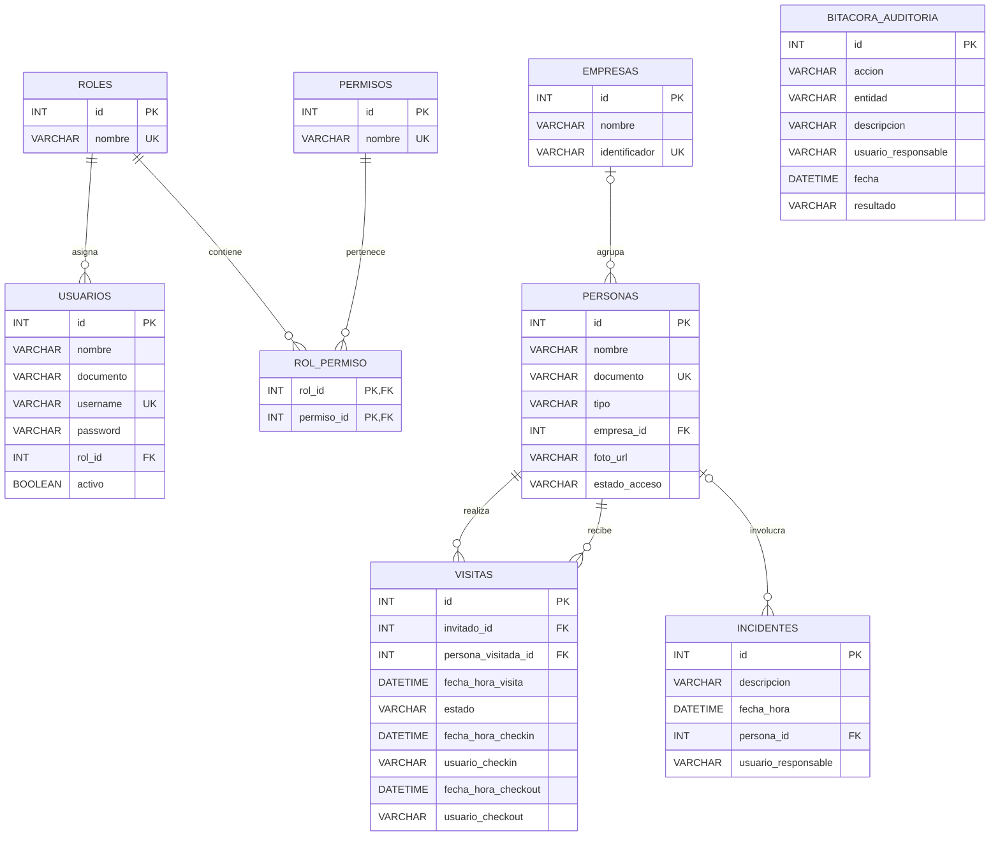

# SICA

Sistema Integrado de Control de Acceso para el complejo empresarial Zona Acme.

## Descripción

SICA es un proyecto Java que administra usuarios, personas, empresas, visitas,
solicitudes de aprobación, accesos, incidentes, auditoría y reportes. Su objetivo
es reemplazar el registro manual de entradas y salidas por información
centralizada, consultable y protegida mediante roles y permisos.

## Problema

Zona Acme reúne a más de 30 empresas, pero su control de acceso se realizaba con
libros de papel y comunicación por radio. Esto ocasionaba filas, información
ilegible, dificultad para conocer quién permanecía dentro y poca trazabilidad
ante incidentes. Tampoco existía una forma centralizada de restringir personas o
autorizar visitantes no anunciados.

## Solución

SICA centraliza los datos en MySQL y aplica las siguientes reglas:

- Autorización RBAC mediante roles y permisos almacenados en la base de datos.
- Pre-registro y consulta de visitas.
- Check-in y check-out con identificación del guarda responsable.
- Aprobación o rechazo de visitantes no anunciados.
- Autorización excepcional para trabajadores que olvidan el carnet.
- Regularización automática de salidas olvidadas.
- Restricción o habilitación del acceso de personas.
- Registro de incidentes de seguridad.
- Bitácora inmutable para las operaciones críticas.
- Reportes de visitas y consulta de trazabilidad.

## Tecnologías

- Java 17.
- Maven.
- MySQL 8.
- JDBC.
- MySQL Connector/J 8.3.0.

## Arquitectura y organización

El proyecto aplica Arquitectura Hexagonal y Vertical Slices. Cada capacidad se
organiza en su propio paquete, por ejemplo `persona`, `visita`, `incidente` o
`auditoria`.

Dentro de cada capacidad se utilizan, cuando corresponden, estas capas:

```text
capacidad/
├── domain/          Entidades y estados del negocio
├── application/     Casos de uso, DTO, excepciones y puertos
└── infrastructure/  Adaptadores JDBC
```

Los servicios de aplicación dependen de interfaces y no conocen las consultas
SQL. Los detalles de MySQL permanecen en los adaptadores de infraestructura.

## Flujo de trabajo Git Flow

El repositorio utiliza un flujo de ramas basado en Git Flow:

- `main`: contiene versiones estables listas para entrega.
- `develop`: integra el trabajo terminado de las diferentes funcionalidades.
- `feature/*`: se crea desde `develop` para desarrollar una historia de usuario.
- `release/*`: se crea desde `develop` para preparar una versión; al finalizar
  se integra en `main` y `develop`.
- `hotfix/*`: se crea desde `main` para corregir un problema urgente; al
  finalizar se integra en `main` y `develop`.

Flujo utilizado para una historia:

```text
develop
└── feature/e10-hu04-patrones
    └── merge hacia develop al terminar y verificar la historia
```

Las ramas `release/*` y `hotfix/*` solo deben crearse cuando exista una
liberación o una corrección urgente real. No se mantienen ramas vacías para
simular su utilización.

## Modelo entidad-relación

El siguiente diagrama representa las tablas y relaciones definidas en
`schema.sql`:



Una persona puede pertenecer a una empresa. Cada visita referencia a la persona
que ingresa y a la persona visitada. Un incidente puede asociarse opcionalmente
a una persona. La bitácora conserva el responsable como texto para mantener su
identidad histórica aunque un usuario sea eliminado.

## Decisiones de diseño

### RBAC almacenado en la base de datos

Los permisos no se determinan mediante condiciones fijas por nombre de rol.
`AutorizacionService` busca el usuario y consulta en `rol_permiso` si su rol
posee el permiso requerido. Esto permite cambiar autorizaciones desde los datos.

### Auditoría desde la capa de aplicación

Los servicios registran en `BitacoraAuditoriaPort` después de completar una
operación crítica. El adaptador agrega fecha, entidad y resultado. Dos triggers
de MySQL impiden modificar o eliminar los registros históricos.

### Estados mediante enumeraciones

`EstadoVisita` y `EstadoAcceso` representan valores permitidos en el código y
evitan utilizar textos diferentes para una misma regla de negocio.

### JDBC aislado en infraestructura

Las conexiones, sentencias SQL y `ResultSet` se utilizan solamente en
`infrastructure`. El dominio y los servicios no dependen de JDBC.

## Principios SOLID

- **SRP:** cada servicio administra una capacidad y cada adaptador se ocupa de
  persistencia.
- **OCP:** puede agregarse otro adaptador implementando un puerto sin modificar
  los servicios.
- **LSP:** cualquier implementación que respete un puerto puede sustituir al
  adaptador JDBC correspondiente.
- **ISP:** existen puertos específicos por capacidad. Auditoría separa escritura
  (`BitacoraAuditoriaPort`) y consulta (`BitacoraConsultaPort`).
- **DIP:** los servicios reciben los puertos mediante sus constructores y no
  crean adaptadores concretos.

## Patrones de diseño

### Repository

Interfaces como `UsuarioRepositoryPort`, `PersonaRepositoryPort`,
`VisitaRepositoryPort` e `IncidenteRepositoryPort` representan las operaciones
de persistencia que necesita la aplicación. Los servicios no contienen SQL y
pueden trabajar con cualquier implementación de estos contratos.

### Adapter

Clases como `UsuarioRepositoryJdbcAdapter`, `PersonaRepositoryJdbcAdapter` y
`VisitaRepositoryJdbcAdapter` traducen las operaciones de los puertos a JDBC.
Este patrón mantiene MySQL fuera de dominio y aplicación.

## Instalación

### Requisitos

Antes de instalar se necesita:

- JDK 17 o superior.
- Maven 3.9 o superior.
- MySQL 8 en ejecución.
- Un usuario de MySQL con permisos para crear la base y sus tablas.

### Configurar la conexión

La conexión se encuentra en:

```text
src/main/java/com/sica/infraestructura/ConexionBD.java
```

Se deben ajustar estos valores según el entorno local:

```java
private static final String URL = "jdbc:mysql://localhost:3306/sica_db";
private static final String USUARIO = "root";
private static final String PASSWORD = "tu_contrasena";
```

### Crear una instalación nueva

En MySQL Workbench se ejecutan, en este orden:

1. `schema.sql` para crear la base, tablas, relaciones y triggers.
2. `data.sql` para cargar roles, permisos y datos de ejemplo.

Estos scripts consolidados se usan sobre una instalación nueva. No deben
ejecutarse repetidamente sobre una base que ya contiene los datos iniciales.

### Compilar

Desde la carpeta que contiene `pom.xml`:

```bash
mvn clean compile
```

Para generar el paquete:

```bash
mvn clean package
```

## Ejecución

La clase principal actual es:

```text
src/main/java/com/sica/Main.java
```

Puede ejecutarse desde el IDE o, después de compilar, con:

```bash
java -cp target/classes com.sica.Main
```

Actualmente `Main` es un punto de entrada mínimo. Las funcionalidades están
implementadas en los servicios de aplicación y todavía no existe una interfaz
gráfica, API REST o menú de consola que exponga todos los casos de uso.

## Guía de uso

Los principales casos de uso disponibles son:

| Operación | Servicio o método principal | Rol de ejemplo |
|---|---|---|
| Iniciar sesión | `LoginService.iniciarSesion` | Todos |
| Crear usuario | `UsuarioService.crearUsuario` | Administrador |
| Gestionar roles | `RolService.asociarPermisoARol` | Administrador |
| Registrar persona | `PersonaService.registrarPersona` | Funcionario |
| Gestionar empresa | `EmpresaService` | Funcionario |
| Pre-registrar visita | `VisitaService.preRegistrarInvitado` | Funcionario |
| Consultar visita | `VisitaService.consultarVisitaPorDocumento` | Guarda |
| Registrar check-in | `VisitaService.registrarCheckIn` | Guarda |
| Registrar check-out | `VisitaService.registrarCheckOut` | Guarda |
| Solicitar visita no anunciada | `VisitaService.registrarVisitanteNoAnunciado` | Guarda |
| Solicitar ingreso por olvido | `VisitaService.solicitarIngresoPorOlvido` | Guarda |
| Aprobar o rechazar solicitud | `VisitaService.aprobarSolicitud` / `rechazarSolicitud` | Funcionario |
| Cambiar estado de acceso | `PersonaService.cambiarEstadoAcceso` | Administrador |
| Registrar incidente | `IncidenteService.registrarIncidente` | Guarda |
| Generar reporte | `ReporteService.generarReporteVisitasPorEstado` | Administrador |
| Consultar bitácora | `AuditoriaService.consultarBitacora` | Administrador |

Para las aprobaciones, el documento del usuario funcionario debe coincidir con
el documento de su registro en `personas`. Los datos iniciales ya cumplen esta
condición.

## Credenciales de ejemplo

Las siguientes credenciales son creadas por `data.sql`:

| Rol | Usuario | Contraseña |
|---|---|---|
| Administrador | `admin` | `admin123` |
| Guarda de Seguridad | `guarda` | `guarda123` |
| Funcionario | `funcionario` | `funcionario123` |

Estas contraseñas son exclusivamente de demostración. El servicio actual las
compara directamente; no deben utilizarse en un entorno de producción.
