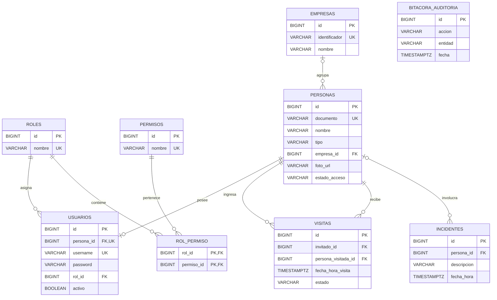

# Modelo entidad-relación de SICA

Esta fuente Mermaid representa el modelo definido en `../../schema.sql`.

```mermaid
erDiagram
    ROLES ||--o{ USUARIOS : asigna
    ROLES ||--o{ ROL_PERMISO : contiene
    PERMISOS ||--o{ ROL_PERMISO : pertenece
    EMPRESAS o|--o{ PERSONAS : agrupa
    PERSONAS ||--o| USUARIOS : posee
    PERSONAS ||--o{ VISITAS : ingresa
    PERSONAS ||--o{ VISITAS : recibe
    PERSONAS o|--o{ INCIDENTES : involucra

    ROLES {
        BIGINT id PK
        VARCHAR nombre UK
    }
    PERMISOS {
        BIGINT id PK
        VARCHAR nombre UK
    }
    ROL_PERMISO {
        BIGINT rol_id PK, FK
        BIGINT permiso_id PK, FK
    }
    EMPRESAS {
        BIGINT id PK
        VARCHAR identificador UK
        VARCHAR nombre
    }
    PERSONAS {
        BIGINT id PK
        VARCHAR documento UK
        VARCHAR nombre
        VARCHAR tipo
        BIGINT empresa_id FK
        VARCHAR foto_url
        VARCHAR estado_acceso
    }
    USUARIOS {
        BIGINT id PK
        BIGINT persona_id FK, UK
        VARCHAR username UK
        VARCHAR password
        BIGINT rol_id FK
        BOOLEAN activo
    }
    VISITAS {
        BIGINT id PK
        BIGINT invitado_id FK
        BIGINT persona_visitada_id FK
        TIMESTAMPTZ fecha_hora_visita
        VARCHAR estado
    }
    INCIDENTES {
        BIGINT id PK
        BIGINT persona_id FK
        VARCHAR descripcion
        TIMESTAMPTZ fecha_hora
    }
    BITACORA_AUDITORIA {
        BIGINT id PK
        VARCHAR accion
        VARCHAR entidad
        TIMESTAMPTZ fecha
    }
```
